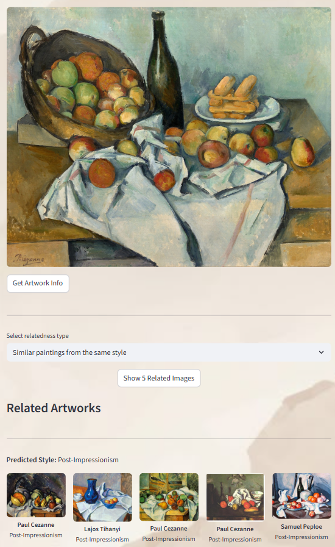
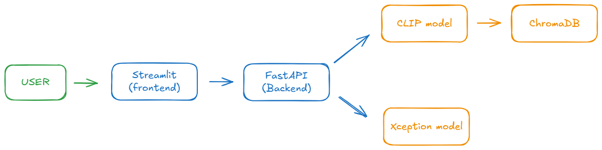
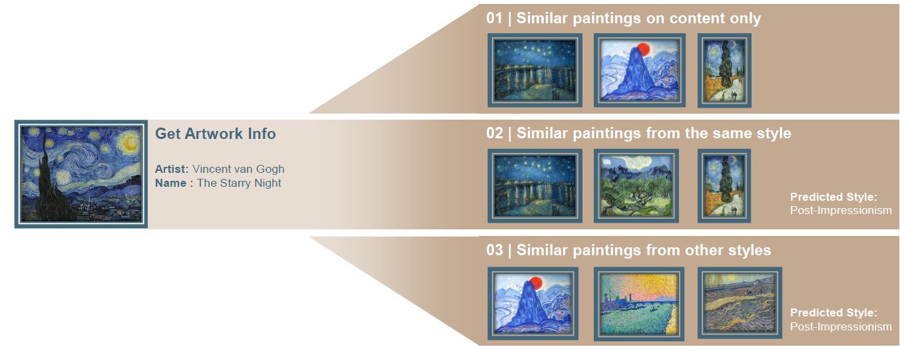

# 🎨 Inspiart: An AI companion to inspire your art journey

**Inspiart** is a machine learning–powered tool that recommends paintings similar to a given artwork. It can also detect its artistic style.
The project is available through an interactive [Streamlit app](https://inspiart-front-ezzt5hf8yf9rfrkaevwu5w.streamlit.app/).

---

## Features
- 🔎 Image-based recommendation of similar artworks
- 🖼️ Automatic detection and classification of artistic styles
- 📊 Interactive web interface to explore the tool

---

## Repository Structure
This project is split into two repositories:
- [inspiart](https://github.com/gwen-m97/inspiart): core code (data preprocessing, model training, recommendation engine, API)
- [inspiart-front](https://github.com/gwen-m97/inspiart-front): Streamlit app

## Technical Overview

### 📂 Dataset
- Used the **[WikiArt dataset](https://www.kaggle.com/datasets/simolopes/wikiart-all-artpieces)** from Kaggle
- Contains more than 170K artworks across different artistic styles
- Cleaning to only keep paintings after 1800. 114K images in the end.

---

### 🤖 Models

1. **CLIP (OpenAI)**
   - Extracted embeddings for all paintings in the dataset
   - Used these embeddings to perform **image similarity search**
   - Qualitatively good results, often retrieves artworks that are obviously related and with same content

2. **Custom Model (Xception-based)**
   - Fine-tuned Xception with additional dense layers for **artistic style classification**
   - Final accuracy achieved: **47%** on the test set (30% of the database)

### 🗄️ Data Storage
- Stored all embeddings in a **ChromaDB** vector database
- Enables fast similarity search across the artwork collection

### ⚙️ Backend
- Built an **API with FastAPI** to serve both:
  - Similarity search results (CLIP)
  - Style predictions (custom Xception model)
- Packaged into a **Docker image** for easier deployment

### ☁️ Deployment
- Deployed the backend on **Google Cloud Platform (GCP)**
- Frontend built with **Streamlit** for an interactive user interface

### 🖼️ Architecture Overview

---

## Demo
How to use Inspiart ?

📹 Demo Video
[Watch the demo on YouTube](https://www.youtube.com/watch?v=uE1tRA1KkAE)

Final presentation :
📄 [View the final presentation (PDF)](assets/Inspiart_final_presentation.pdf)

## Project context
Team project realized during the Data Science & AI Bootcamp at Le Wagon.
2 weeks with a team of 5 to develop a solution using data and AI.
